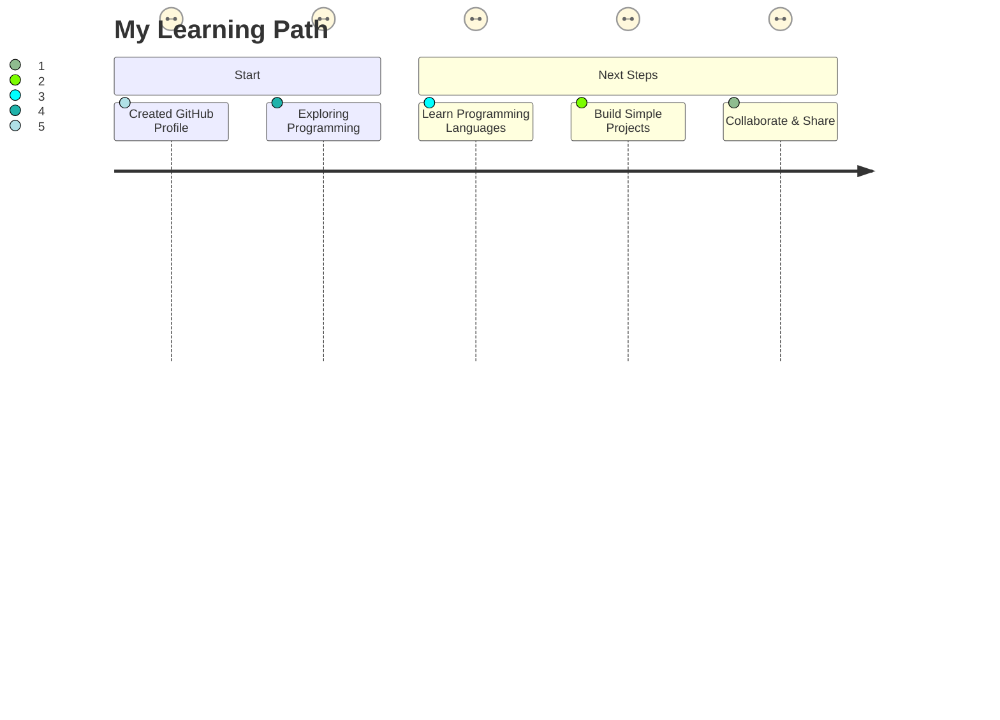

<h1 align="center">Hi there, I'm Armandeep singh from berlin 👋</h1>

  

---

### 👨‍🎓 About Me

- 🎓 **Bachelor of Software Engineering** (Student)
- 🏫 Currently learning and exploring programming
- 📚 Eager to dive into the world of coding and development
- 🌱 Learning programming languages and software engineering concepts
- 👀 Looking for guidance and inspiration from the amazing GitHub community

---

### 🚀 My Journey

---

### 🛠️ Tech Stack

this is my portfolio website-: http://127.0.0.1:5500/index.html

I'm just getting started, but soon I'll be learning:
-  Python
-  Java
-  JavaScript
-  HTML5 &  CSS3

---

### 📈 GitHub Stats

  

---

### ✨ Quote

> "Learning to write programs stretches your mind, and helps you think better." – Bill Gates

---

### 📫 How to reach me

- Email: 2006.armansingh@gmail.com
  

---

  

